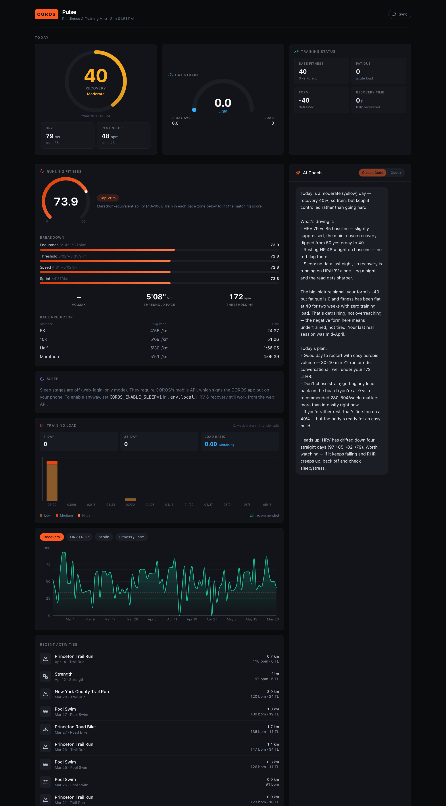
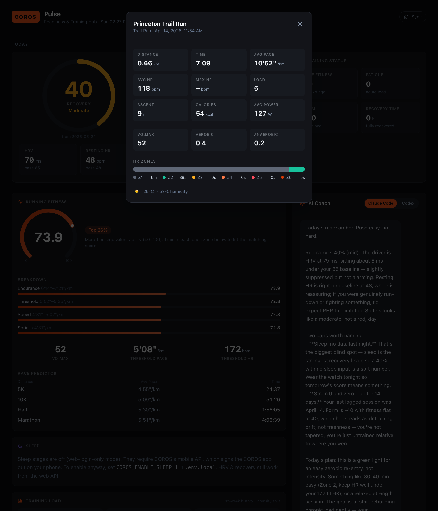

# COROS Pulse

[](LICENSE)


**A personal fitness dashboard with a built-in AI coach, powered by your own
[COROS](https://coros.com) training data.**

COROS Pulse runs on your own computer, signs in to your COROS account, and turns
your watch data into three easy-to-read daily scores — **Recovery**, **Strain**,
and **Sleep** — plus an **AI coach** that reads your latest numbers and tells you,
in plain English, what to do today.

> COROS also offers an official, read-only
> [MCP server](https://coros.com/stories/coros-metrics/c/mcp-testing) you can plug
> into Claude or ChatGPT. COROS Pulse is different: it's a full app you run
> yourself, with its own dashboard, charts, and coach.



---

## What you get

| Score | What it means |
| --- | --- |
| **Recovery** (0–100%, green / yellow / red) | How ready your body is today. Built from your sleep **HRV** vs. your baseline (50%) + **resting heart rate** vs. baseline (30%) + **sleep** quality (20%). |
| **Day Strain** (0–21) | How much cardiovascular load you've taken on today, from your COROS **training load**. |
| **Sleep** | Time asleep vs. an 8-hour need, plus deep / REM / light / awake stages. *(Needs the optional sleep setting — see below.)* |
| **Fitness / Fatigue / Form** | Your COROS EvoLab fitness, fatigue, and freshness trend (the CTL / ATL / TSB you may know from other apps). |
| **Running Fitness & VO₂max** | Your EvoLab running-fitness score, ability breakdown, and race-time predictions. |
| **Trends** | 90-day charts of recovery, HRV, resting HR, strain, fitness, and form. |
| **Per-run detail** | Tap any workout for splits, heart-rate zones, VO₂max, and weather. |
| **AI Coach** | An AI assistant that reads your live snapshot and answers *"what should I do today?"* — runs on the Claude Code CLI, the Codex CLI, or the Anthropic API (you choose). |



---

## Before you start

You'll need:

- **A COROS account** with some recorded activities (the same login you use at
  [t.coros.com](https://t.coros.com)).
- **A computer** — macOS, Windows, or Linux.
- **About 15 minutes.** No coding experience required — just follow the steps.

Everything runs **on your own machine**. Your COROS password is only ever sent to
COROS (and never to the browser or to us — there is no "us"; this is open-source
software you run yourself).

---

## Setup — step by step

### 1. Install Node.js

Node.js is the free runtime this app is built on.

- Go to **[nodejs.org](https://nodejs.org)** and download the **LTS** version.
- Run the installer and accept the defaults.
- **Windows:** during install, keep the box that adds Node to your PATH checked.

To confirm it worked, open a terminal (see step 3) and type:

```bash
node -v
```

You should see a version number like `v20.x.x` (any version **18.17 or newer** is
fine).

### 2. Download COROS Pulse

**The easy way (no Git needed):**

1. Go to the project's GitHub page.
2. Click the green **`<> Code`** button → **Download ZIP**.
3. Unzip it somewhere easy to find, like your Desktop.

**Or, if you know Git:**

```bash
git clone https://github.com/CLRT19/coros-mcp.git
```

### 3. Open a terminal in the project folder

A "terminal" is the text window where you type commands.

- **macOS:** open the **Terminal** app, type `cd ` (with a space), then drag the
  project folder onto the window and press **Enter**.
- **Windows:** open the project folder in File Explorer, click the address bar,
  type `cmd`, and press **Enter**.

You should now see the folder's name on the command line.

### 4. Install the app's parts

In that terminal, run:

```bash
npm install
```

This downloads everything the app needs. It runs once and may take a minute.

### 5. Add your COROS login

Make a copy of the example settings file. On **macOS / Linux**:

```bash
cp .env.example .env.local
```

On **Windows**, use this instead:

```
copy .env.example .env.local
```

Open the new **`.env.local`** file in any text editor and fill in your details:

```bash
COROS_EMAIL=you@example.com       # your COROS login email
COROS_PASSWORD=your-coros-password
COROS_REGION=us                   # us, eu, or cn — whichever you signed up in
```

`.env.local` stays on your computer and is never uploaded or shared.

### 6. Start it

```bash
npm run dev
```

Open **[http://localhost:3000](http://localhost:3000)** in your browser. That's it —
your dashboard is live. 🎉

To stop the app, click the terminal and press **Ctrl + C**. To start it again later,
just run `npm run dev` from the project folder.

---

## Set up the AI coach (optional)

The coach needs an AI "backend." You have **three options** — pick whichever fits.
The app auto-detects what's available and shows a toggle in the coach panel; if none
is set up, the panel tells you how to enable one.

### Option A — Claude Code CLI

A command-line tool from Anthropic. Uses the login you already have — **no API key
to paste**. Your Claude account's usage terms apply.

1. Install it: see **[claude.com/claude-code](https://claude.com/claude-code)**.
2. Sign in once (`claude` in a terminal, then follow the prompts).
3. Restart COROS Pulse (`npm run dev`). The coach will detect it.

### Option B — Codex CLI

OpenAI's command-line tool. Also uses your existing login — **no API key to paste**.
Your account's usage terms apply.

1. Install it: see **[github.com/openai/codex](https://github.com/openai/codex)**.
2. Sign in once.
3. Restart COROS Pulse.

### Option C — Anthropic API key

The most direct option, and the simplest if you don't want to install a CLI. It
calls the Anthropic API and costs a few cents per conversation.

1. Create a key at **[console.anthropic.com](https://console.anthropic.com)**.
2. Paste it into your `.env.local`:
   ```bash
   ANTHROPIC_API_KEY=sk-ant-...
   ```
3. Restart COROS Pulse.

---

## Sleep data (optional, advanced)

By default the dashboard uses COROS's **web** login, which is a separate session
from the COROS app on your phone — using it won't log you out there. Detailed
**sleep stages**, however, are only available through COROS's **mobile** login.

> ⚠️ **Heads up:** turning sleep on performs a *mobile* login, which can **log you
> out of the COROS app on your phone**. Everything else in the dashboard works fine
> without it. Only enable this if you're okay with that trade-off.

To enable it, set this in `.env.local`:

```bash
COROS_ENABLE_SLEEP=1
```

---

## Settings reference

Everything below lives in your `.env.local` file.

| Setting | What it does | Default |
| --- | --- | --- |
| `COROS_EMAIL` | Your COROS login email. | — (required) |
| `COROS_PASSWORD` | Your COROS password. Only ever sent to COROS. | — (required) |
| `COROS_REGION` | Your account region: `us`, `eu`, or `cn`. | `us` |
| `COROS_ENABLE_SLEEP` | `1` to pull sleep stages via the mobile API (see warning above). | `0` |
| `COACH_PROVIDER` | Which coach backend the toggle starts on: `claude`, `codex`, or `anthropic`. | `claude` |
| `ANTHROPIC_API_KEY` | Needed **only** for the `anthropic` backend. | empty |
| `COACH_MODEL` | Model used by the `anthropic` (API) backend. | `claude-sonnet-4-6` |
| `COACH_CLI_MODEL` | Model passed to the CLI backends (`claude` / `codex`). Optional. | each CLI's default |
| `CLAUDE_CLI_PATH` | Manual path to the `claude` binary, if auto-detection misses it. | auto-detected |
| `CODEX_CLI_PATH` | Manual path to the `codex` binary, if auto-detection misses it. | auto-detected |

---

## Privacy & safety

- COROS Pulse runs **entirely on your own computer**. There is no server we control.
- Your COROS password lives **only** in `.env.local`, which is git-ignored and never
  committed or sent to the browser. It is used server-side only, to log in to COROS.
- Your data leaves your machine when the app talks to COROS, and whenever you use
  the AI coach — each coach backend sends your current fitness snapshot to its AI
  provider to generate a reply (the Anthropic API and the Claude Code CLI send it to
  Anthropic; the Codex CLI sends it to OpenAI). If you never open the coach, only
  COROS is contacted.
- **Not medical advice.** COROS Pulse is for general fitness insight only.

---

## How it works (for the curious)

```
COROS Training Hub API  ──►  lib/coros.ts     (auth + endpoints)
                             lib/metrics.ts   (readiness scoring)
                             lib/data.ts      (cached loader)
                                  │
                   ┌──────────────┴───────────────┐
        app/api/summary/route.ts          app/api/coach/route.ts
            (metrics JSON)                 (AI coach, streaming)
                   │                              │
              app/page.tsx  ──►  dashboard + AI coach panel
```

COROS Pulse talks to COROS's **unofficial** Training Hub API (reverse-engineered
from the COROS web and mobile apps). The main endpoints it uses:

- `POST /account/login` — sign in (password is MD5-hashed) → access token
- `GET /dashboard/query` — recovery state, resting HR, running fitness, thresholds,
  race predictions, and the last ~7 nights of HRV
- `GET /dashboard/detail/query` — recent VO₂max (when there's been a recent run test)
- `GET /analyse/dayDetail/query` — daily fitness / fatigue / form / load / resting HR
- `GET /analyse/query` — weekly training-load history + recommended range
- `GET /activity/query` — your workout list
- `POST /activity/detail/query` — per-workout detail (splits, HR zones, VO₂max, weather)
- `POST /coros/data/statistic/daily` — sleep stages (mobile API; only when
  `COROS_ENABLE_SLEEP=1`)

Want to confirm the COROS connection from the terminal without opening the browser?

```bash
npm run coros:check
```

---

## Troubleshooting

| Problem | Fix |
| --- | --- |
| `node` or `npm` "not found" | Node.js isn't installed (or the terminal predates the install). Redo **Step 1** and open a fresh terminal. |
| Login fails / "Couldn't load your COROS data" | Double-check `COROS_EMAIL`, `COROS_PASSWORD`, and especially `COROS_REGION` in `.env.local`. |
| **VO₂max shows `—`** | COROS only reports VO₂max after a recent run; it fills in automatically once you log one. |
| Coach says "No AI backend available" | Set up one of the three coach options above, then restart the app. |
| "Port 3000 is already in use" | Another app is using that port. Stop it, or run `npm run dev -- -p 3001` and open `http://localhost:3001`. |
| Data looks stale | Click **Refresh** in the app, or add `?refresh=1` to the URL. Data is cached for 3 minutes. |

---

## Disclaimer

COROS Pulse is an **independent, unofficial** project. It is **not affiliated with,
authorized, or endorsed by COROS**, and "COROS" is a trademark of its respective
owner. It relies on undocumented endpoints that may change or break at any time.
Use at your own risk.

## License

MIT — see [LICENSE](LICENSE). Contributions welcome; see [CONTRIBUTING.md](CONTRIBUTING.md).
